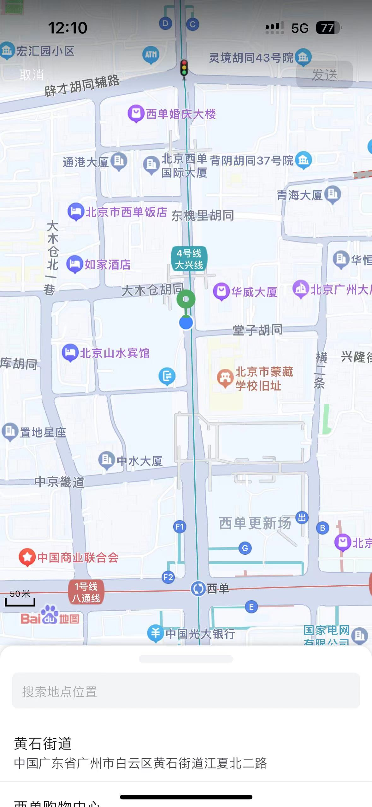
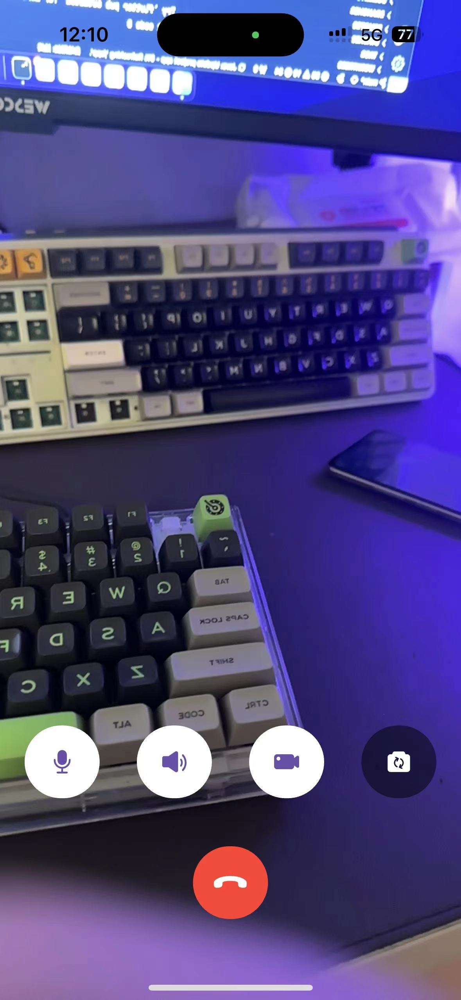
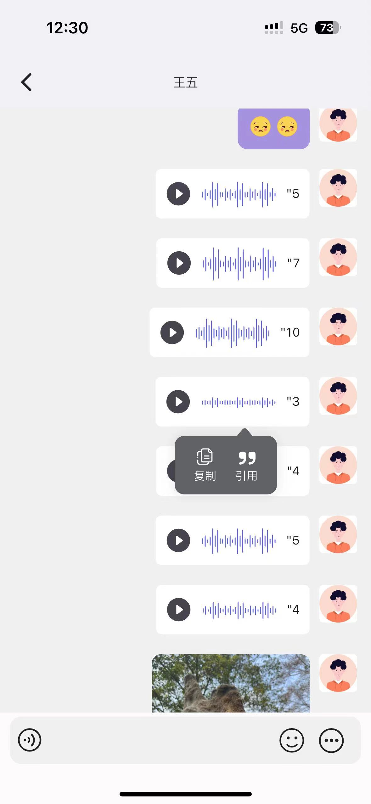
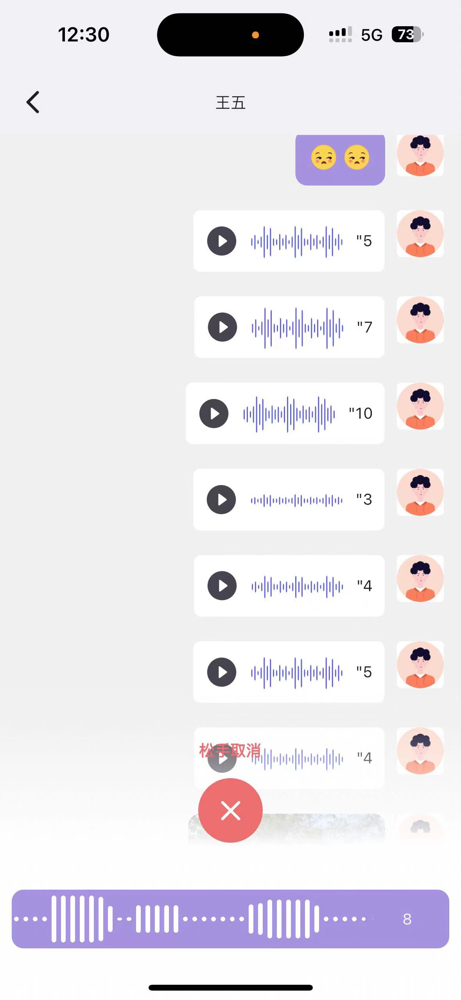
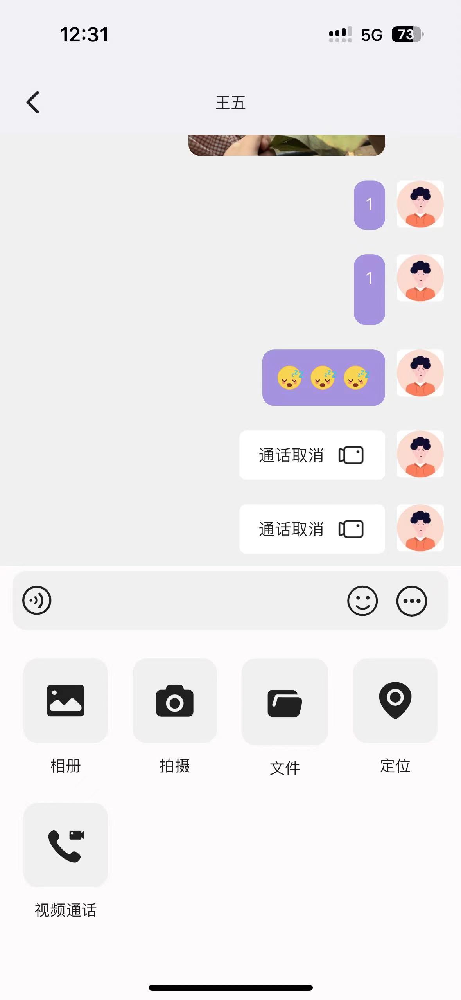

# 乐悠云社

云端交友社区，注重用户细节体验，性能逼近原生微信抖音体验，正在开发中，临时开源

# 特点技术

1. 解决了flutter 消息列表默认渲染底部和数据少渲染顶部问题（大部分人会用倒序），不采用倒序倒叙通过偏移计算实现
2. 解决了查看历史消息，有人发送消息不会产生滚动问题，会默认定位在当前位置

## 待完成模块

* [ ]  IM
  * [X]  好友聊天
  * [ ]  群聊
* [ ]  社区
* [ ]  商城
* [ ]  音视频
  * [X]  1v1
  * [X]  app内小窗通话
  * [ ]  画中画通话
* [ ]  登录
  * [X]  账号密码登录
  * [ ]  微信登录

# 测试账号

1. 王五 123456

# 预览图

